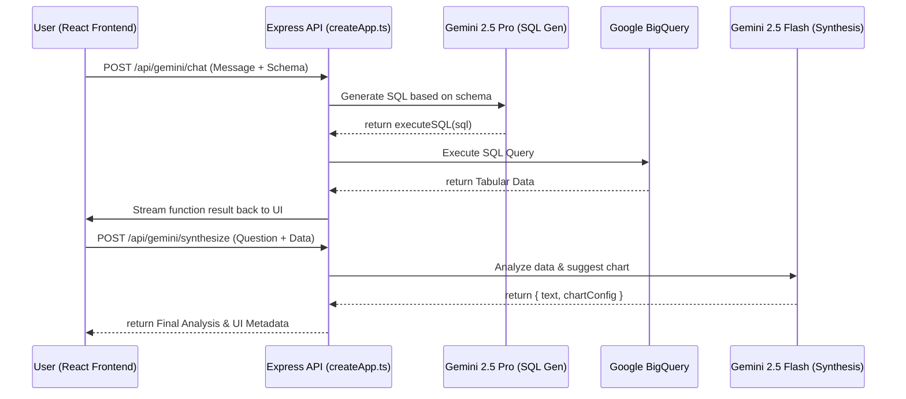

# System Architecture - InsightStream

This document provides a deep dive into the technical architecture of InsightStream, explaining the data flow, security model, and component orchestration.

## High-Level Data Flow

InsightStream uses a "Reflective Pipeline" where natural language is iteratively transformed into structured data and visual insights.

## Security Model

Security is baked into the "factory" level of the application in `createApp.ts`.

### 1. Identity & Session
- **OAuth 2.0**: All data requests use the user's specific OAuth access token.
- **CSRF Protection**: A unique CSRF token is generated per session and verified on all `POST` requests via the `x-csrf-token` header.
- **Secure Cookies**: Using `cookie-session` with `httpOnly`, `secure` (in production), and `Partitioned` (CHIPS) attributes for iframe stability.

### 2. SQL Safety Guards
To prevent prompt injection and unauthorized data access:
- **Allowlist**: Only `SELECT` and `WITH` statements are permitted.
- **Dangerous Pattern Blocking**: Regex-based blocking of `DROP`, `DELETE`, `UPDATE`, `INSERT`, etc.
- **Row Capping**: All queries are automatically appended with a `LIMIT 500` if not present.

### 3. Rate Limiting
Granular rate limits are applied per route group:
- **Auth**: 10 attempts per 15 minutes.
- **Queries**: 30 queries per minute.
- **AI Streaming**: 30 turns per minute.

## Component Responsibilities

### Backend (Node.js/Express)
- **Token Management**: Refreshing Google OAuth tokens automatically.
- **Schema Caching**: Caching BigQuery table schemas (TTL 5m) to avoid redundant API calls.
- **Log Ingestion**: Centralized client-side error reporting for observability.

### Frontend (React/Vite)
- **State Orchestration**: `App.tsx` manages the chat history, session state, and streaming coordination.
- **Visual Synthesis**: `AnalyticsChart.tsx` maps the JSON chart configuration to Recharts components dynamically.
- **UI System**: Powered by `shadcn/ui` for a premium, accessible interface.
